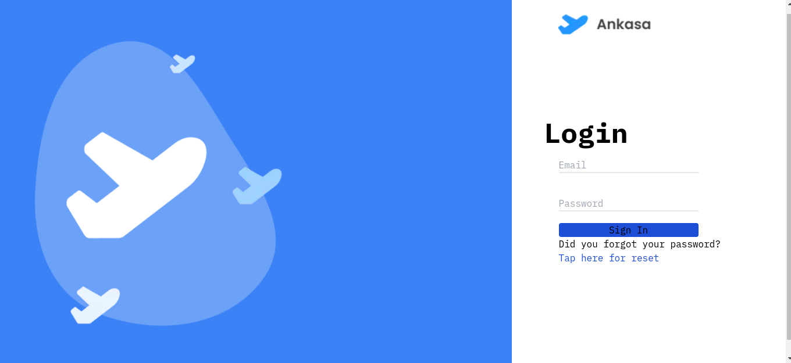
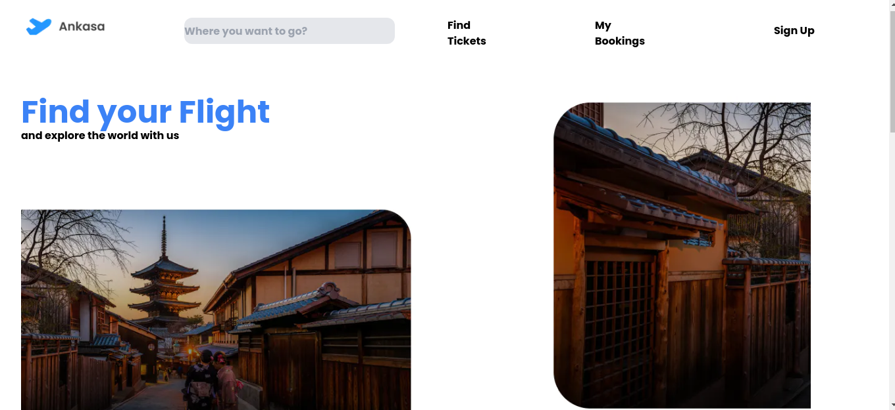
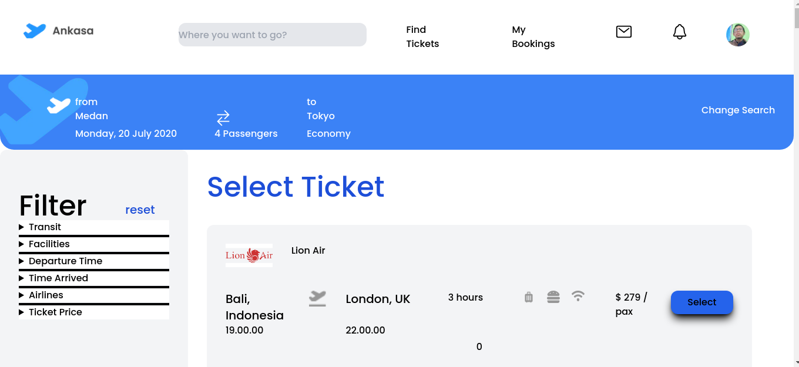
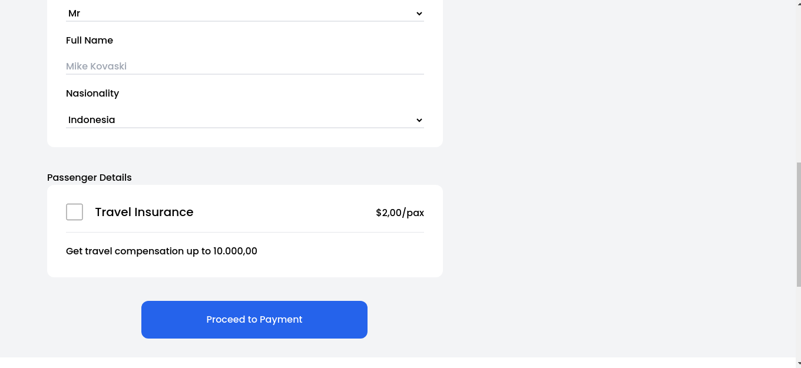
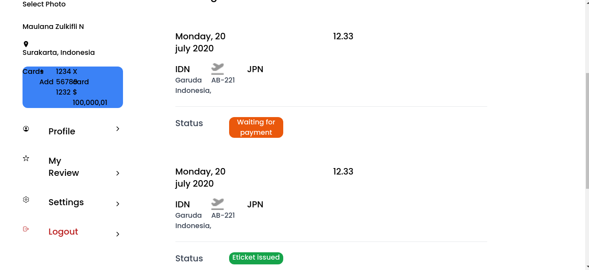
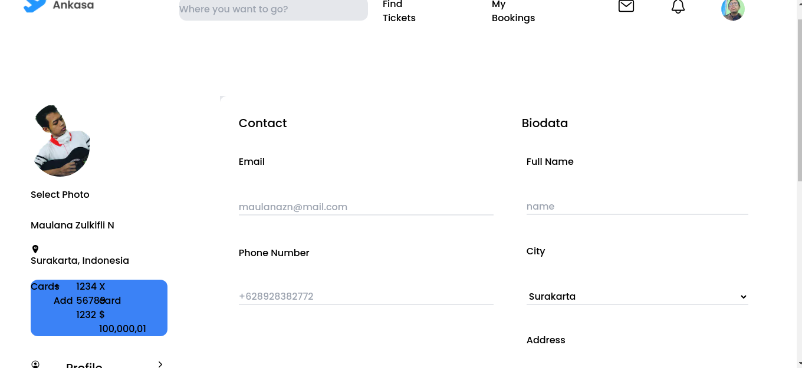

<div align="center">
    <h1>Angkasa Travel</h1>
    <image src="public/screenshot/plane.png" width="230">
    <p>Part of <a href="https://github.com/eanp/bookflight">angkasa backend</a>. Angkasa Travel is a website that used for book ticket. Fellow with other technologies like below</p>
</div>

---

<div align="center">
    This part built with some common technology, such as:
    <ul>
        <li><a href="https://nodejs.org/en"></a></li>
        <li><a href="https://tailwindcss.com/"></a></li>
        <li><a href="https://nextjs.org/"></a></li>
    </ul>
</div>

## Prerequisite:
- Computer
- Internet
- NodeJS
- Bun

## Installation

First, install bun on your system:
```bash
npm i -g bun
```
or you can look at https://bun.sh

Second, install the dependencies
```bash
bun install
```

Third, run the development server:

```bash
bun run dev
```

Open [http://localhost:3000](http://localhost:3000) with your browser to see the result.

## Screenshots

| image    |    page    |
|----------|------------|
|  | Login | 
|  | HomePage |
|  | All Tickets | 
|  | Booking | 
|  | My Booking | 
|  | Profile | 

## Learn More

To learn more about Next.js, take a look at the following resources:

- [Next.js Documentation](https://nextjs.org/docs) - learn about Next.js features and API.
- [Learn Next.js](https://nextjs.org/learn) - an interactive Next.js tutorial.

You can check out [the Next.js GitHub repository](https://github.com/vercel/next.js/) - your feedback and contributions are welcome!

## Deploy on Vercel

The easiest way to deploy your Next.js app is to use the [Vercel Platform](https://vercel.com/new?utm_medium=default-template&filter=next.js&utm_source=create-next-app&utm_campaign=create-next-app-readme) from the creators of Next.js.

Check out our [Next.js deployment documentation](https://nextjs.org/docs/deployment) for more details.
